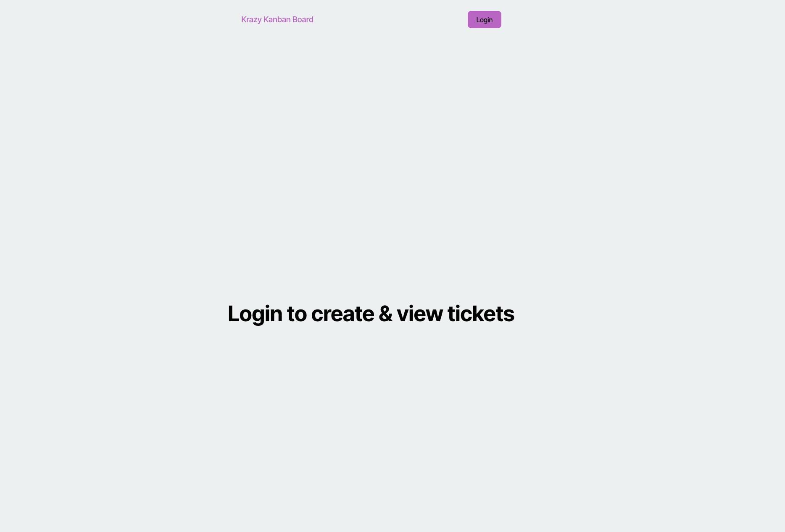

# Kanban Board

This project is a **Kanban Board application** with **JWT authentication** for secure user login and task management.

##  Features
- **User Authentication** using JWT
- **Login Page** with validation
- **Protected Kanban Board** (requires login)
- **Task Management** (CRUD operations)
- **Backend API** with PostgreSQL

---

##  Installation & Setup

###  Clone the repository
```sh
git clone https://github.com/mikealiaga/Kanban-Board.git
```

### Install dependencies
```sh
npm install
```

### Create a .env file inside server and add
```sh
DB_NAME='kanban_db'
DB_USER='your_database_user'
DB_PASSWORD='your_database_password'
JWT_SECRET_KEY='your_secret_key'
```

##  Author
[GitHub - mikealiaga](https://github.com/mikealiaga)

### App Screenshot


